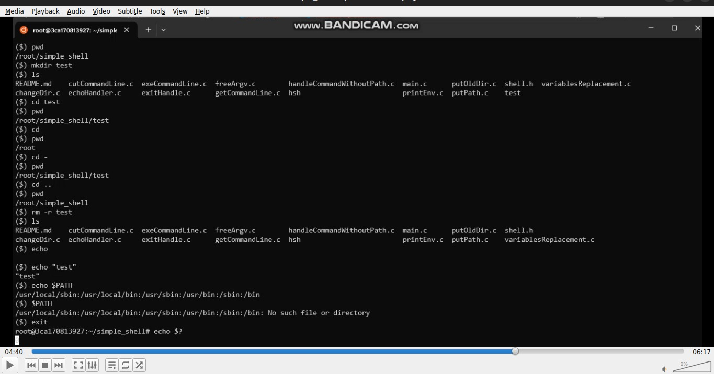

# Simple Shell Project 
# ALX SE Foundations Project  C - Simple Shell
# by: `Omar Adel Shalaan` and `Nesma Abdelazim`
## [Omar Adel Shalaan linkedin](https://www.linkedin.com/in/omar-adel-shalaan/) and [Nesma Abdelazim linkedin](https://www.linkedin.com/in/nesma-abdelazim/)

# Shell Handle 
- ### The command lines are made only of one word.
- ### If an executable cannot be found, print an error message
- ### handle the “end of file” condition (Ctrl+D)
- ### Handle command lines with arguments
- ### Handle the PATH
- ### Handle exit
- ### Handle env built-in, that prints the current environment
- ### Handle cd, cd -, cd [DIRECTORY]
- ### Handle variables replacement

# Compilation
### Your shell will be compiled this way:
### `gcc -Wall -Werror -Wextra -pedantic -std=gnu89 *.c -o hsh`

# Memcheck, a memory error detector
### `valgrind -s --leak-check=full --show-leak-kinds=all ./hsh`

## General
1. Who designed and implemented the original Unix operating system
2. Who wrote the first version of the UNIX shell
3. Who invented the B programming language (the direct predecessor to the C programming language)
4. Who is Ken Thompson
5. How does a shell work
6. What is a pid and a ppid
7. How to manipulate the environment of the current process
8. What is the difference between a function and a system call
9. How to create processes
10. What are the three prototypes of main
11. How does the shell use the PATH to find the programs
12. How to execute another program with the execve system call
13. How to suspend the execution of a process until one of its children terminates
14. What is EOF / “end-of-file”?

## From chatGPT
1. **Designers of Original Unix Operating System:** The original Unix operating system was primarily designed and implemented by Ken Thompson, Dennis Ritchie, and a team at Bell Labs in the late 1960s.

2. **Writer of the First Version of UNIX Shell:** Ken Thompson wrote the first version of the UNIX shell, known as the Thompson shell (sh).

3. **Inventor of the B Programming Language:** Ken Thompson is credited with inventing the B programming language, which served as a precursor to the development of the C programming language.

4. **Ken Thompson:** Ken Thompson is a renowned computer scientist, one of the principal creators of the Unix operating system, co-creator of the B programming language, and a significant contributor to the development of the C programming language.

5. **Functioning of a Shell:** A shell is a command-line interface that interprets user commands and interacts with the operating system to execute these commands. It parses the commands, identifies the programs or actions requested, and coordinates their execution by interacting with the operating system's kernel.

6. **PID and PPID:** PID (Process ID) is a unique numerical identifier assigned to each process running on a Unix-like operating system. PPID (Parent Process ID) refers to the PID of the parent process that spawned a particular process.

7. **Manipulating the Environment of the Current Process:** To manipulate the environment of the current process in Unix-like systems, you can use commands like `export` to set environment variables or modify the shell's environment directly using commands like `set`.

8. **Difference Between a Function and a System Call:** A function is a block of reusable code within a program that performs a specific task. A system call, on the other hand, is a request made by a program to the operating system's kernel to perform tasks that require higher privileges, such as I/O operations, process creation, etc.

9. **Creating Processes:** Processes can be created in Unix-like systems using system calls such as `fork()` or `exec()`.

10. **Three Prototypes of Main:** The three prototypes of the `main` function in C are commonly:
    - `int main(void)`
    - `int main(int argc, char *argv[])`
    - `int main(int argc, char *argv[], char *envp[])`

11. **Shell's Use of PATH to Find Programs:** The shell uses the `PATH` environment variable to locate executable programs. It searches directories listed in `PATH` sequentially to find the executable file associated with a given command.

12. **Executing Another Program with `execve()`:** The `execve()` system call in Unix-like systems is used to execute another program, replacing the current process with the new one specified in the function call.

13. **Suspending Execution of a Process Until Child Termination:** To suspend the execution of a process until one of its children terminates, Unix-like systems provide system calls like `wait()` or `waitpid()`.

14. **EOF (End-of-File):** EOF represents the end of a file or input stream in a computer operating system. It's a condition indicating that no more data can be read from the data source. In C programming, `EOF` is represented by a symbolic constant used to detect the end of input from functions like `getchar()` or file operations.

## List of allowed functions and system calls
- access (man 2 access)
- chdir (man 2 chdir)                    
- close (man 2 close)
- closedir (man 3 closedir)
- execve (man 2 execve)
- exit (man 3 exit)
- _exit (man 2 _exit)
- fflush (man 3 fflush)
- fork (man 2 fork)
- free (man 3 free)
- getcwd (man 3 getcwd)
- getline (man 3 getline)
- getpid (man 2 getpid)
- isatty (man 3 isatty)
- kill (man 2 kill)
- malloc (man 3 malloc)
- open (man 2 open)
- opendir (man 3 opendir)
- perror (man 3 perror)
- read (man 2 read)
- readdir (man 3 readdir)
- signal (man 2 signal)
- stat (__xstat) (man 2 stat)
- lstat (__lxstat) (man 2 lstat)
- fstat (__fxstat) (man 2 fstat)
- strtok (man 3 strtok)
- wait (man 2 wait)
- waitpid (man 2 waitpid)
- wait3 (man 2 wait3)
- wait4 (man 2 wait4)
- write (man 2 write)

## Resources
#### Read or watch:
- [Everything you need to know to start coding your own shell](https://intranet.alxswe.com/concepts/64)
- [Unix shell](https://en.wikipedia.org/wiki/Unix_shell)
- [Thompson shell](https://intranet.alxswe.com/rltoken/7LJOp2qP7qHUcsOK2-F3qA)
- [Ken Thompson](https://intranet.alxswe.com/rltoken/wTSu31ZP1f7fFTJFgRQC7w)

## Try Shell
### Download this file: [hsh](./hsh)

## video

